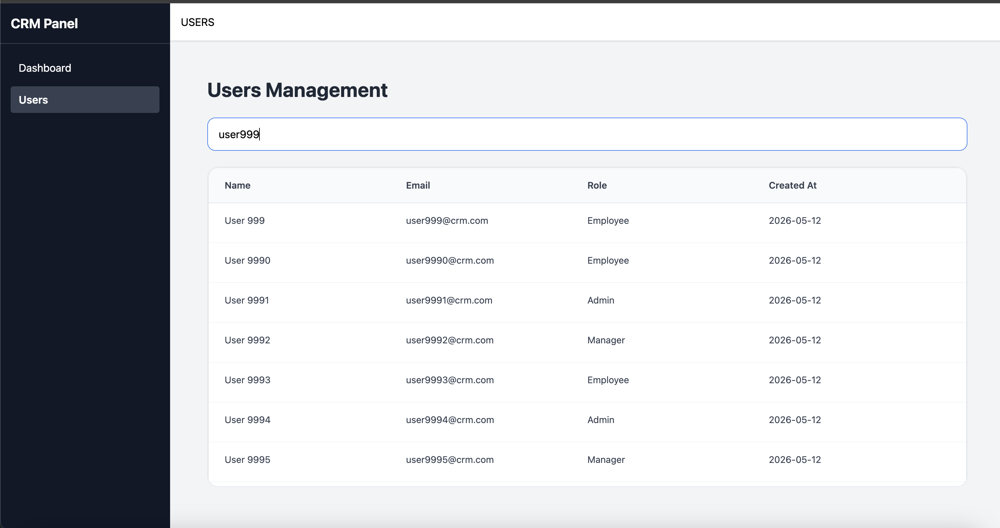
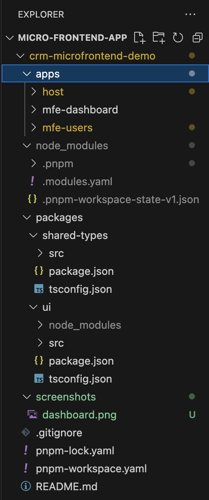

# CRM Microfrontend Dashboard

Scalable enterprise CRM dashboard built with React, TypeScript, Module Federation and modern frontend architecture principles.

## Preview

## Features

- Microfrontend architecture
- Shared UI package
- Shared TypeScript types
- Virtualized rendering
- Concurrent React rendering
- Sticky enterprise dashboard layout
- Searchable users management

## Tech Stack

| Technology        | Purpose                    |
| ----------------- | -------------------------- |
| React             | UI library                 |
| TypeScript        | Type safety                |
| Vite              | Build tool                 |
| Tailwind CSS      | Styling                    |
| Module Federation | Microfrontend architecture |
| React Window      | Virtualization             |

## Architecture

apps/
host/
mfe-users/

packages/
ui/
shared-types/

## Performance Optimization

The users module handles 100,000+ records using:

- React Window virtualization
- useDeferredValue
- Memoized filtering
- Isolated scrolling containers

## Installation

pnpm install

## Run Host

cd apps/host
npm run dev

## Future Improvements

- Authentication
- RBAC
- React Query
- Realtime updates
- Docker
- CI/CD

